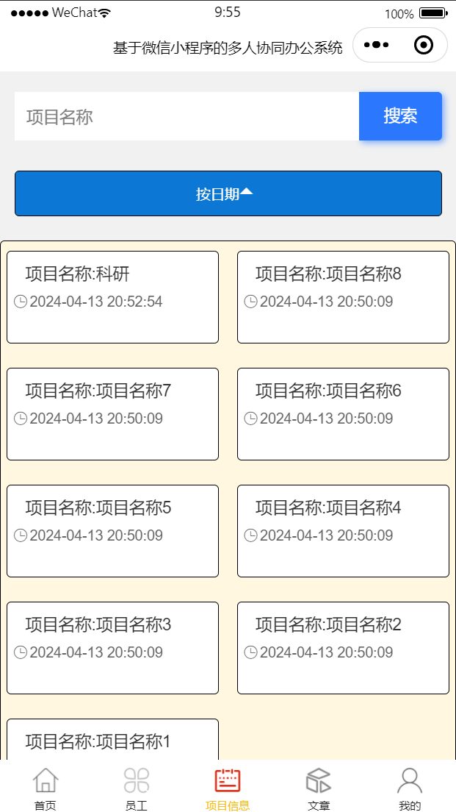
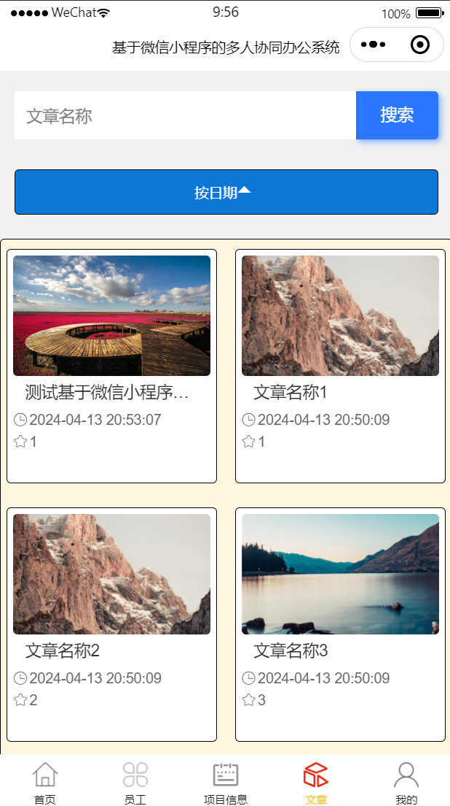
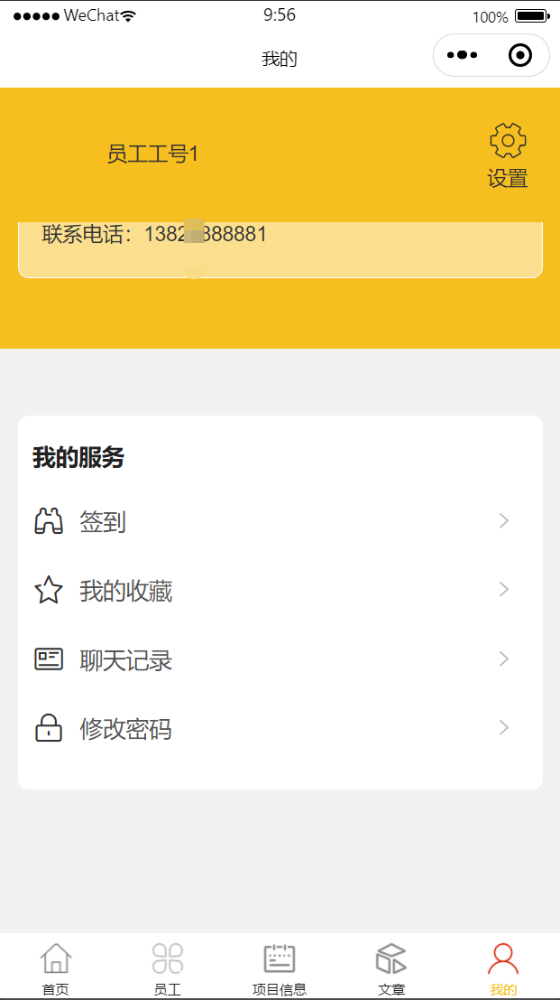
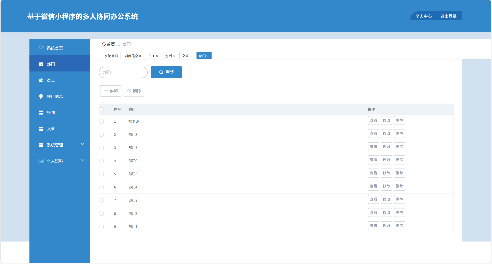
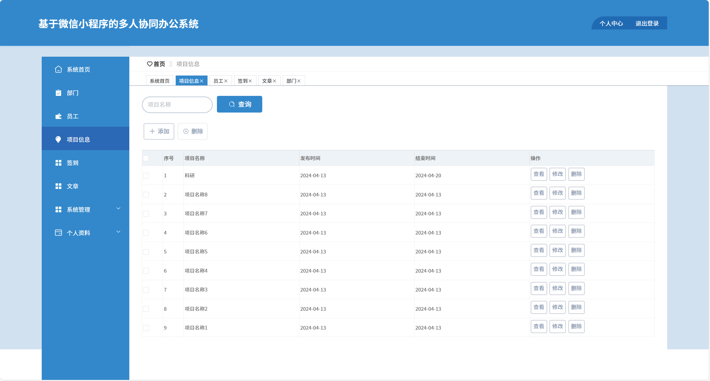
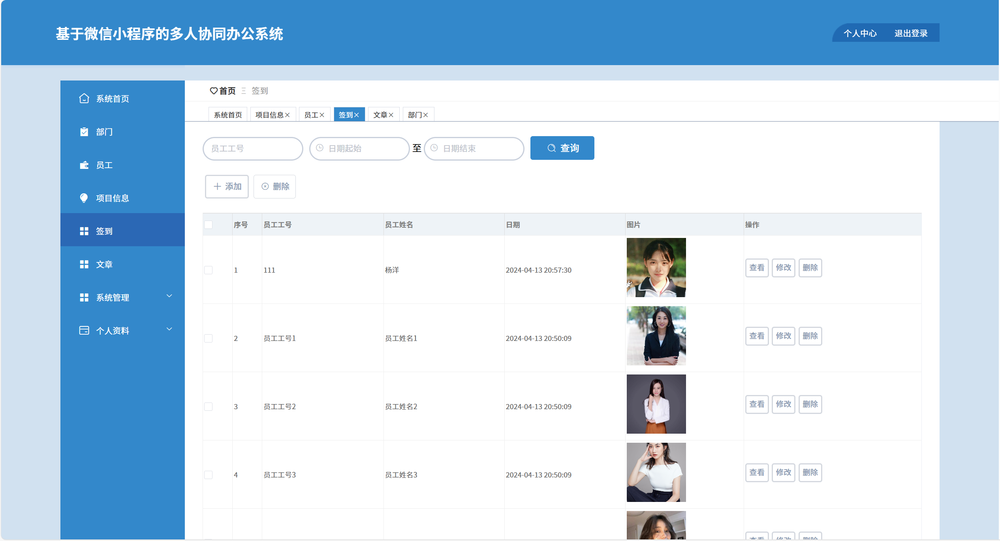
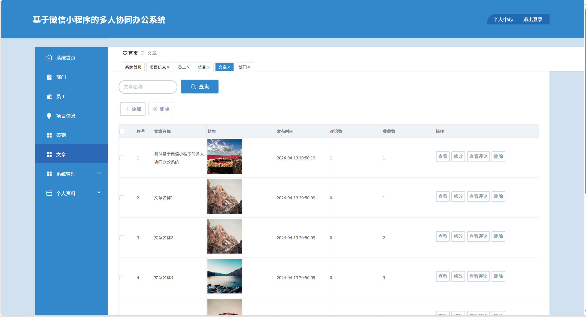

# mpweixinA092
mpweixinA092多人协同办公微信小程序
 
## 查看主页获取源码

### 一、关键词
团队协作办公小程序，多人在线办公小程序，协同办公小程序

### 二、作品包含
源码+数据库+全套环境和工具资源+本地部署教程

### 三、项目技术
前端技术： Html、Css、Js、Vue2.0、Element-ui、uniapp
后端技术：Java、SpringBoot2.0、MyBatis

### 四、运行环境（以下版本亲测，其他版本兼容性请自行测试）
开发工具：IDEA/eclipse  + VSCODE + 微信开发者工具 + HBuilder X

数据库：MySQL5.7（最低要5.7版本）

数据库管理工具：Navicat10以上版本

环境配置软件： JDK1.8 + Maven3.6.3

前端Nodejs：14

浏览器：谷歌浏览器

### 五、项目介绍
项目编号：mpweixinA092

多人协同办公微信小程序可让团队成员通过手机随时随地进行文档协作、任务分配与跟踪、日程管理、即时通讯等，从而提高工作效率，促进信息流通和共享。
项目信息管理：可按项目名称搜索，还能对项目进行添加、删除、查看、修改等操作，方便管理项目相关内容。
文章管理：支持按文章名称搜索，可添加、删除文章，也能查看、修改文章以及查看文章评论，助力文章的发布与维护。
签到管理：能通过员工工号、日期范围查询签到记录，可添加、删除签到信息，也可查看、修改签到内容，便于对员工签到情况进行管控。
部门管理：可查询部门，能添加、删除部门，还能查看、修改部门信息，用于企业部门的组织与管理。
员工管理：（从整体系统逻辑及常见协同办公需求推测，结合部门、项目等关联）用于管理员工的基本信息等，为协同办公提供人员基础数据支持。
个人服务：包含签到、查看收藏、查看聊天记录、修改密码等功能，满足用户个人办公相关操作与设置需求。

### 六、运行截图

